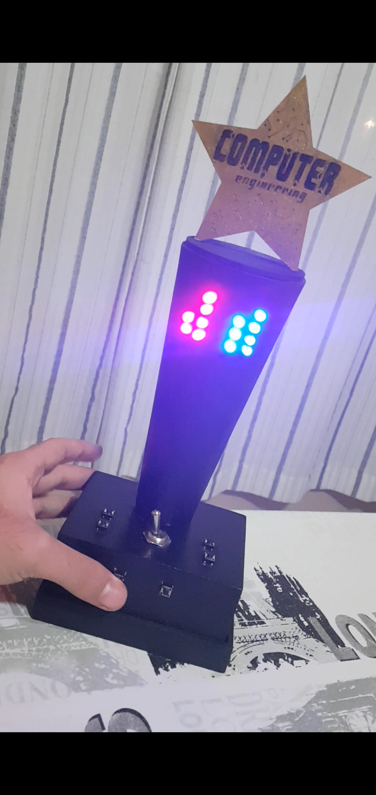

# Relógio Binário
Just an Arduino based binary clock with a buzzer.

> Este foi meu primeiro projeto desenvolvido durante minha graduação em Engenharia da Computação. Tal trabalho consistiu na construção de um relógio binário microcontrolado por uma placa de desenvolvimento Arduino UNO.

O projeto consiste em uma interface de monitoramento do horário com display em leds que indicam dezenas e unidades tanto para as horas quanto para os minutos em números binários.
Além disso, há a função de alarme, na qual o usuário pode definir um horário (a partir do uso dos botões e visualização nos leds) para que o alarme seja acionado. Quando o horário definido no alarme é alcançado, os leds piscam e uma música é reproduzida a partir de um buzzer alocado dentro do dispositivo.

> Um relógio binário é aquele que ao invés de utilizar da base decimal para informar as horas, utiliza a base binária para o mesmo, tornando a leitura do horário menos convencional.
