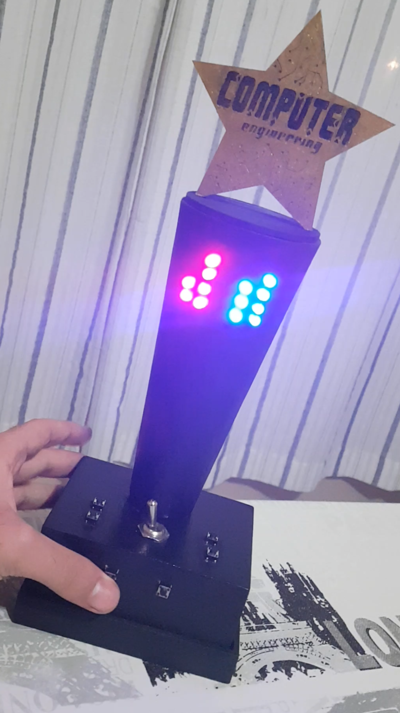

# Relógio Binário
Just an Arduino based binary clock with a buzzer.

> Este foi meu primeiro projeto desenvolvido durante minha graduação em Engenharia da Computação. Tal trabalho consistiu na construção de um relógio binário microcontrolado por uma placa de desenvolvimento Arduino UNO.

> Um relógio binário é aquele que ao invés de utilizar da base decimal para informar as horas, utiliza a base binária para o mesmo, tornando a leitura do horário menos convencional.
